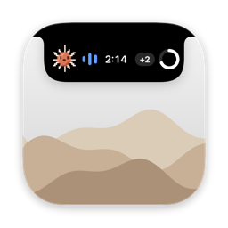

<div align="center">



# Notchbuddy

Your coding agents, live in the notch.

A free macOS app that shows your **Claude Code**, **Codex** and **Kimi Code** sessions in the notch, Dynamic Island style.

[English](#english) · [Русский](#русский)


<sub>Video: [notchbuddy.mp4](docs/media/notchbuddy.mp4) (1920×1080, 60 fps) · [smaller](docs/media/notchbuddy-readme.mp4) · 4K 120 fps master in [Releases](https://github.com/pytodai/NotchBuddy/releases)</sub>

</div>

---

## English

Notchbuddy sits at the top of the screen and keeps track of the coding agents you have running. You can see which one is working, which one needs you and which one has finished. Permission requests can be answered right from the island, so you don't have to look for the right terminal tab.

### Features

- Every running session with its state (working, needs you, done, error, idle) and a timer. The closed island shows the most important one; hover to see the full list.
- Permission requests on the island. The card shows exactly what will run: the full command, path or diff, every argument and the model's own explanation. Answer with **Allow** (⌘Y), **Deny** (⌘N), **Always** (when Claude offers a rule) or **In terminal** (⌘T). A new card ignores clicks for half a second, so a double click can't approve something you haven't seen.
- When an agent finishes, the Done card shows its last answer (Claude, Codex) with **Jump**, **Copy** and **Close**.
- Click a session to bring its iTerm2 or Terminal tab, tmux pane or host app (Claude, Codex, VS Code, Ghostty, Warp…) to the front. Notchbuddy never launches an app that isn't running.
- 5-hour and weekly usage limits for Claude, Codex and Kimi in the list header. Click to switch agents (Auto → Claude → Codex → Kimi).
- An animated pixel mascot for each agent that shows what its session is doing: thinking, working, waiting for you, done, error, idle.
- Two styles. Notch sits flush with the top edge around the camera housing. Island is a capsule floating just below it, like the iPhone's Dynamic Island, and its closed width is adjustable. You choose the style separately for external displays and for a screen with a notch. Macs without a notch work too.
- Optional widgets: music, calendar, timer, system and a file shelf. Drop files on the notch to keep them there and drag them back out when you need them. All widgets are off by default.
- Animations are played by the window server (Core Animation), so they stay at 60 fps even while the Mac is busy compiling. The island never takes keyboard focus on its own, and clicks next to it go to the apps underneath.
- English and Russian, switched live in Settings.

### Supported agents

| Agent | Works with | Status and notices | Answer from the island | Usage limits |
|---|---|---|---|---|
| **Claude Code** | terminal, Claude desktop app, VS Code | ✓ | Allow · Always · Deny · In terminal | 5-hour and 7-day (statusLine, or the usage API) |
| **Codex** | CLI, desktop app, VS Code | ✓ | Allow · Deny · In terminal | from Codex's own logs on this Mac |
| **Kimi Code** | CLI, VS Code, kimi-desktop | ✓ | No, answer in Kimi (its hooks can't reply) | via Kimi's API (opt-in) |
| Cursor, GitHub Copilot, Cline, Grok CLI *(experimental)* | installed from Settings → Agents and hooks | ✓ | Copilot CLI: Allow · Deny | — |

### Requirements

- macOS 14 Sonoma or later.
- Xcode or its Command Line Tools with a Swift 6 toolchain. Notchbuddy is built with Xcode 27 / Swift 6.4.
- [ffmpeg](https://formulae.brew.sh/formula/ffmpeg) from Homebrew, only for the promo video scripts in `scripts/promo`.

### Install

```bash
git clone https://github.com/pytodai/NotchBuddy.git
cd NotchBuddy
scripts/build-app.sh --install
```

This builds `NotchBuddy.app` in release mode and signs it with your first "Apple Development" certificate, or ad hoc if there is none (set `NOTCHBUDDY_SIGN_IDENTITY` to pick one). Then it copies the app to `~/Applications` and starts it. On first launch Notchbuddy offers to install hooks for the agents it finds; the island works right away. Restart running Codex and Kimi sessions so they pick up the hooks.

There are no prebuilt binaries yet.

### Hooks

Notchbuddy gets its events through each agent's own hook system. Install, check or remove the hooks from the menu bar (Hooks), from Settings → Agents and hooks, or from the terminal:

```bash
~/.notchbuddy/bin/notchbuddy-bridge hooks status
~/.notchbuddy/bin/notchbuddy-bridge hooks install all     # or: claude codex kimi
~/.notchbuddy/bin/notchbuddy-bridge hooks uninstall all
```

| Agent | Config file |
|---|---|
| Claude Code | `~/.claude/settings.json` |
| Codex | `~/.codex/hooks.json` (+ trust entries in `~/.codex/config.toml`) |
| Kimi Code | `~/.kimi-code/config.toml` |

Every edit first backs the file up to `~/.notchbuddy/backups/`, leaves other hooks alone and refuses to write a file it can't parse. If Notchbuddy isn't running or something goes wrong, the hook exits silently and the agent behaves as if it weren't there.

### Using it

- Hover over the closed island to open the session list; move away and it closes. A pointer just passing over it doesn't open it.
- Click a session to expand it: full prompt, last answer, recent tool calls, Jump, Copy path, Open folder, Remove.
- 📌 keeps the island open. ⌃⌥N opens or closes it from anywhere (change it in Settings → Hotkey).
- ⌘Y, ⌘N and ⌘T answer a permission card while the pointer is over it.

### Settings

Click ⚙️ in the open island, or Settings… in the menu bar. Changes apply immediately.

- Island: hover delay or click only, show requests at once, pin the open list, notice length, show the agent's answer when it finishes, style (Notch or Island) for displays with and without a notch, capsule width for the Island style, size, display.
- Sounds: on/off, volume, a sound per event.
- Agents and hooks: status, install, reinstall, remove.
- Limits: Claude via API, Kimi via API, the usage ring, whose limits to show, refresh rate.
- Also Hotkey, Widgets, Appearance, Language (Auto / English / Русский), Launch at login, and Privacy and logs.

### Widgets

Widgets are off by default, so out of the box the island shows only your sessions and no widget service runs. Turn them on in Settings → Widgets and the open island gets a tab strip (click a tab or swipe with two fingers).

- Music: Spotify and Apple Music, with artwork, progress and playback controls.
- Calendar: today and tomorrow, "in 7 min" with a Join button for calls.
- Timer: presets and custom timers, with a sound and a small celebration at the end.
- System: battery, CPU, memory and disk.
- Shelf: drop files on the notch to park them there, then drag them out wherever you need them.

### Privacy

- No analytics, crash reporting, auto-updates, accounts or licensing.
- The only network requests:
  - Claude limits via API (on by default, one switch turns it off): `api.anthropic.com/api/oauth/usage`, at most every 5 minutes, with the token Claude Code keeps in your Keychain. The token is only read, never refreshed or stored. With the switch off there is no network call and no Keychain access.
  - Kimi limits via API: off by default.
  - Music widget (off by default): album artwork from Spotify's CDN.
- Hook events travel over a Unix socket that only your user can open (`~/.notchbuddy/run`, mode 0600, peer uid checked).
- Logs stay on your Mac, in `~/Library/Logs/NotchBuddy/`.

### How it works

```
agent ──hook──▶ notchbuddy-bridge ──unix socket──▶ NotchBuddy.app ──▶ island
                  ▲                                     │
                  └───── decision (permissions only) ◀──┘
```

`notchbuddy-bridge` reads the hook event, forwards it to the app and, for permission requests, waits for your answer (up to 10 minutes). On any failure it prints nothing and exits 0, so the agent falls back to its own prompt.

### FAQ

**Does it need a MacBook with a notch?** No. On other displays the island hangs from the top edge like a virtual notch, or floats as a capsule if you choose the Island style.

**Will it get in my way?** The island takes the mouse only over its own shape and never takes keyboard focus by itself. Everything around it stays clickable.

**Claude also asks in the terminal. Which answer wins?** Whichever comes first. If you answer in the terminal, the card goes away.

**Why is there no "Always" for Codex, and no buttons for Kimi?** Codex hooks don't support remembered rules. Kimi hooks can't answer at all, so Kimi requests show up as "needs you" and you answer in Kimi.

**Does it slow my Mac down?** Animations run in the window server. Notchbuddy commits each transition once and does nothing per frame. Hidden mascots and widgets are paused.

**How do I remove it?**

```bash
~/.notchbuddy/bin/notchbuddy-bridge hooks uninstall all
rm -rf ~/Applications/NotchBuddy.app ~/.notchbuddy ~/Library/Logs/NotchBuddy
defaults delete me.sokolov.notchbuddy
```

Remove the hooks first: Kimi's hook calls the bridge directly.

### Development

```bash
swift build
swift test
```

A detailed guide (in Russian) is in [docs/guide.ru.md](docs/guide.ru.md), and [docs/island-architecture.md](docs/island-architecture.md) describes the island's animation engine. `NotchBuddy --render-previews <dir>` draws every state without starting the app. `scripts/promo/render.sh` re-renders the video above.

### License

Notchbuddy is released under the MIT License, see [LICENSE](LICENSE). The bundled Manrope font (`Resources/Fonts`) is licensed under the [SIL Open Font License 1.1](Resources/Fonts/OFL.txt).

### Credits

- Typeface: [Manrope](https://github.com/sharanda/manrope) by Mikhail Sharanda and the Manrope Project Authors.
- The pixel mascots are homages to each agent's icon, drawn in code.
- Inspired by Apple's Dynamic Island.

### Trademarks

Claude and Anthropic, Codex, ChatGPT and OpenAI, Kimi and Moonshot AI, Apple, macOS and Dynamic Island, Spotify, and the other product names mentioned here are trademarks of their respective owners. Notchbuddy is an independent project and is not affiliated with or endorsed by any of them. The app ships no agent icons: it reads them at runtime from the apps installed on your Mac. The mascots and drawn agent marks only identify the agent they stand for.

---

## Русский

Notchbuddy живёт у верхнего края экрана и следит за запущенными ИИ-агентами. Видно, кто работает, кто ждёт вас и кто закончил. На запросы разрешений можно отвечать прямо с острова, не разыскивая нужную вкладку терминала.

### Возможности

- Все запущенные сессии и их состояние (работает, ждёт вас, готово, ошибка, простаивает) с таймером. Свёрнутый остров показывает самую важную сессию; наведите курсор, чтобы увидеть весь список.
- Запросы разрешений на острове. Карточка показывает ровно то, что будет выполнено: полную команду, путь или дифф, все аргументы и пояснение модели. Ответ: **Разрешить** (⌘Y), **Запретить** (⌘N), **Всегда** (если Claude предложил правило) или **В терминал** (⌘T). Новая карточка полсекунды не принимает клики, поэтому двойной клик не разрешит то, чего вы не видели.
- Когда агент закончил, карточка «Готово» показывает его последний ответ (Claude, Codex) с кнопками **Перейти**, **Скопировать** и **Закрыть**.
- Клик по сессии выводит вперёд её вкладку iTerm2 или Терминала, панель tmux или приложение (Claude, Codex, VS Code, Ghostty, Warp…). Незапущенные приложения Notchbuddy не открывает.
- Пятичасовой и недельный лимиты Claude, Codex и Kimi в заголовке списка. Клик переключает агента (Авто → Claude → Codex → Kimi).
- У каждого агента свой анимированный пиксельный персонаж. Он показывает, что происходит в сессии: думает, работает, ждёт вас, готово, ошибка, простаивает.
- Два стиля. «Чёлка» прилегает к верхнему краю вокруг выреза камеры. «Островок» парит капсулой чуть ниже, как Dynamic Island на iPhone, и его ширину в свёрнутом виде можно настроить. Стиль выбирается отдельно для мониторов и для экрана с вырезом. На Mac без выреза тоже работает.
- Виджеты по желанию: музыка, календарь, таймер, система и полка для файлов. Бросьте файлы на чёлку, чтобы они полежали там, и вытащите обратно, когда понадобятся. По умолчанию все виджеты выключены.
- Анимацию проигрывает оконный сервер (Core Animation), поэтому она держит 60 кадров в секунду, даже когда Mac занят сборкой. Остров сам не забирает клавиатуру, а клики рядом с ним уходят в окна под ним.
- Русский и английский, переключаются в настройках на лету.

### Поддерживаемые агенты

| Агент | Где | Статус и уведомления | Ответ с острова | Лимиты |
|---|---|---|---|---|
| **Claude Code** | терминал, приложение Claude, VS Code | ✓ | Разрешить · Всегда · Запретить · В терминал | 5 часов и 7 дней (statusLine или API) |
| **Codex** | CLI, приложение, VS Code | ✓ | Разрешить · Запретить · В терминал | по журналам самого Codex на этом Mac |
| **Kimi Code** | CLI, VS Code, kimi-desktop | ✓ | Нет, отвечать в Kimi (его хуки не умеют отвечать) | через API Kimi (включается вручную) |
| Cursor, GitHub Copilot, Cline, Grok CLI *(экспериментально)* | ставятся из ⚙️ → «Агенты и хуки» | ✓ | Copilot CLI: Разрешить · Запретить | — |

### Что нужно

- macOS 14 Sonoma или новее.
- Xcode или его Command Line Tools со Swift 6. Notchbuddy собирается на Xcode 27 / Swift 6.4.
- [ffmpeg](https://formulae.brew.sh/formula/ffmpeg) из Homebrew, только для скриптов промо-ролика в `scripts/promo`.

### Установка

```bash
git clone https://github.com/pytodai/NotchBuddy.git
cd NotchBuddy
scripts/build-app.sh --install
```

Скрипт собирает `NotchBuddy.app` в режиме release и подписывает первым сертификатом «Apple Development», а если его нет, то ad hoc (свой сертификат задаётся через `NOTCHBUDDY_SIGN_IDENTITY`). Затем копирует приложение в `~/Applications` и запускает. При первом запуске Notchbuddy предложит установить хуки найденным агентам; остров работает сразу. Уже запущенные сессии Codex и Kimi перезапустите, чтобы они подхватили хуки.

Готовых сборок пока нет.

### Хуки

Notchbuddy получает события через систему хуков самих агентов. Установить, проверить или удалить хуки можно в меню («Хуки»), в ⚙️ → «Агенты и хуки» или из терминала:

```bash
~/.notchbuddy/bin/notchbuddy-bridge hooks status
~/.notchbuddy/bin/notchbuddy-bridge hooks install all     # или: claude codex kimi
~/.notchbuddy/bin/notchbuddy-bridge hooks uninstall all
```

| Агент | Файл настроек |
|---|---|
| Claude Code | `~/.claude/settings.json` |
| Codex | `~/.codex/hooks.json` (+ записи доверия в `~/.codex/config.toml`) |
| Kimi Code | `~/.kimi-code/config.toml` |

Перед каждой правкой файл копируется в `~/.notchbuddy/backups/`, чужие хуки не трогаются, а файл, который не удаётся разобрать, установщик не перезаписывает. Если Notchbuddy не запущен или что-то пошло не так, хук молча завершается, и агент работает как без него.

### Как пользоваться

- Наведите курсор на свёрнутый остров, и откроется список сессий; уведите, и он закроется. Курсор, который просто пролетает мимо, остров не открывает.
- Клик по сессии раскрывает её: полный запрос, последний ответ, недавние инструменты, «Перейти», «Скопировать путь», «Открыть папку», «Убрать».
- 📌 держит остров открытым. ⌃⌥N открывает и закрывает его откуда угодно (меняется в ⚙️ → «Горячая клавиша»).
- ⌘Y, ⌘N и ⌘T отвечают на карточку разрешения, пока курсор над ней.

### Настройки

⚙️ в открытом острове или «Настройки…» в меню. Всё применяется сразу.

- Остров: задержка при наведении или только по клику, показывать запросы сразу, закреплять открытый список, длительность уведомления, показывать ответ агента при завершении, стиль («Чёлка» или «Островок») для мониторов и для экрана с вырезом, ширина капсулы «Островка», размер, экран.
- Звуки: вкл/выкл, громкость, свой звук на каждое событие.
- Агенты и хуки: статус, установка, переустановка, удаление.
- Лимиты: Claude через API, Kimi через API, кольцо лимита, чьи лимиты показывать, частота обновления.
- А также «Горячая клавиша», «Островки» (виджеты), «Оформление», «Язык · Language» (Авто / Русский / English), «Запуск при входе», «Приватность и логи».

### Виджеты

По умолчанию виджеты выключены: из коробки остров показывает только ваши сессии, и ни один сервис виджетов не запущен. Включите нужные в ⚙️ → «Островки», и в открытом острове появится полоса вкладок (клик по вкладке или свайп двумя пальцами).

- Музыка: Spotify и «Музыка», обложка, перемотка, управление.
- Календарь: сегодня и завтра, «через 7 мин» с кнопкой «Подключиться» для звонков.
- Таймер: готовые и свои таймеры, в конце звук и небольшой салют.
- Система: батарея, процессор, память, диск.
- Полка: бросьте файлы на чёлку, они полежат там, а потом их можно вытащить куда нужно.

### Приватность

- Никакой аналитики, отчётов о сбоях, автообновлений, аккаунтов и лицензий.
- Сетевые запросы только такие:
  - Лимиты Claude через API (включено по умолчанию, выключается одним переключателем): `api.anthropic.com/api/oauth/usage`, не чаще раза в 5 минут, с токеном, который Claude Code хранит в связке ключей. Токен только читается, он не обновляется и не сохраняется. Если выключить, не будет ни сети, ни обращений к связке ключей.
  - Лимиты Kimi через API: по умолчанию выключено.
  - Виджет «Музыка» (по умолчанию выключен): обложки альбомов с CDN Spotify.
- События хуков идут через Unix-сокет, доступный только вашему пользователю (`~/.notchbuddy/run`, права 0600, проверка uid собеседника).
- Логи остаются на вашем Mac, в `~/Library/Logs/NotchBuddy/`.

### Как это устроено

```
агент ──hook──▶ notchbuddy-bridge ──unix socket──▶ NotchBuddy.app ──▶ остров
                  ▲                                     │
                  └──── решение (только разрешения) ◀───┘
```

`notchbuddy-bridge` читает событие хука, передаёт его приложению и для запросов разрешений ждёт вашего ответа (до 10 минут). При любой ошибке он ничего не печатает и выходит с кодом 0, и агент просто задаёт свой обычный вопрос.

### Вопросы и ответы

**Нужен MacBook с вырезом?** Нет. На других экранах остров свисает от верхнего края как виртуальный вырез или парит капсулой, если выбрать стиль «Островок».

**Не будет мешать?** Остров берёт мышь только над своей формой и сам никогда не забирает клавиатуру. Всё вокруг него остаётся кликабельным.

**Claude спрашивает ещё и в терминале. Чей ответ засчитается?** Тот, что пришёл первым. Если ответить в терминале, карточка исчезнет сама.

**Почему у Codex нет «Всегда», а у Kimi вообще нет кнопок?** Хуки Codex не поддерживают запоминаемые правила. Хуки Kimi не умеют отвечать, поэтому его запросы показываются как «ждёт тебя», и отвечать нужно в самом Kimi.

**Не тормозит Mac?** Анимацию играет оконный сервер. Notchbuddy отдаёт каждый переход один раз и ничего не делает на каждом кадре. Невидимые персонажи и виджеты стоят на паузе.

**Как удалить?**

```bash
~/.notchbuddy/bin/notchbuddy-bridge hooks uninstall all
rm -rf ~/Applications/NotchBuddy.app ~/.notchbuddy ~/Library/Logs/NotchBuddy
defaults delete me.sokolov.notchbuddy
```

Сначала удалите хуки: хук Kimi вызывает мост напрямую.

### Разработка

```bash
swift build
swift test
```

Подробное руководство лежит в [docs/guide.ru.md](docs/guide.ru.md), устройство анимации острова описано в [docs/island-architecture.md](docs/island-architecture.md). `NotchBuddy --render-previews <каталог>` рисует все состояния без запуска приложения. `scripts/promo/render.sh` пересобирает ролик выше.

### Лицензия

Notchbuddy распространяется по лицензии MIT, см. [LICENSE](LICENSE). Шрифт Manrope в `Resources/Fonts` распространяется по [SIL Open Font License 1.1](Resources/Fonts/OFL.txt).

### Благодарности

- Шрифт: [Manrope](https://github.com/sharanda/manrope), Михаил Шаранда и авторы проекта Manrope.
- Пиксельные персонажи — оммажи иконкам агентов, нарисованы в коде.
- Вдохновлено Dynamic Island от Apple.

### Товарные знаки

Claude и Anthropic, Codex, ChatGPT и OpenAI, Kimi и Moonshot AI, Apple, macOS и Dynamic Island, Spotify и другие упомянутые здесь названия продуктов являются товарными знаками своих владельцев. Notchbuddy — независимый проект, он не связан ни с одной из этих компаний и не одобрен ими. Иконок агентов в приложении нет: оно берёт их во время работы из приложений, установленных на вашем Mac. Персонажи и нарисованные значки агентов лишь обозначают агента, которого представляют.
